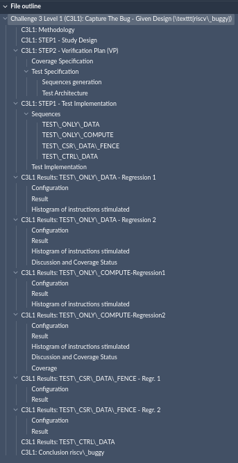

# riscv_ctb_challenges

This repository contains multiple challenges, each representing a different level of difficulty. Each challenge is located in a separate subdirectory and focuses on fixing bugs in specific codebases.

## Challenge Level 1: RISCV-V Assembly Bug Fixes

- challenge1_logical
- challenge2_loop
- challenge3_illegal

## Challenge Level 2: AAPG Bug Fixes

- challenge1_instructions
- challenge2_exceptions

## Challenge Level 3: Capture Bugs in riscv_buggy

- random_test / Final report topics:
  - 
- riscv_dv_coverage

Please note that each subdirectory mentioned above contains a separate README file that provides detailed information about the tasks and guidelines for that particular challenge.
