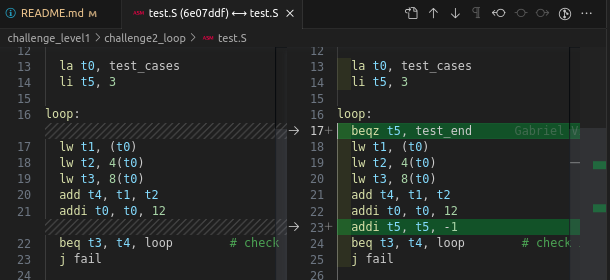

# Challenge Level 2 - Loop

The Challenge Level 2 - Loop bug is described below, along with its solution.

### Bug: Loop - Overview

The "test.S" file takes an input constant vector formatted as follows:

```
.word a # input 1
.word b # input 2
.word r # result of a+b, i.e., r=a+b 
```

#### Goal of "test.S"

The goal of "test.S" is as follows:

1) To create instructions to load the inputs and the expected result;
2) To perform the ADD operation;
3) To check the expected value against the calculated value.

The number of tests will be the number of constant vectors, which is a multiple of 3x (i.e., 3, 9, 12, etc.), divided by 3. In this case, there are 9 memory allocations, resulting in 9/3 = 3 test cases. This value is loaded into t5:

```
li t5, 3
```

### Cause

Analyzing the code below, the first set of instructions will load the two inputs and the expected result into t1, t2, and t3, respectively. After that, the pointer t0, which points to the allocated test cases, is incremented by 12 to get the next test case. Then, the "beq" instruction checks if the expected value saved in t3 is equal to the calculated value in t4. If they are equal, the loop restarts to get the next test case. Otherwise, a jump to the "fail" routine is executed.

```assembly
loop:
  lw t1, (t0)
  lw t2, 4(t0)
  lw t3, 8(t0)
  add t4, t1, t2
  addi t0, t0, 12
  beq t3, t4, loop  # check if the sum is correct
  j fail
```

In summary, the code analyzed does not have a stop condition. After the 3 tests (3 test_cases vectors), the pointer t0 continues to fetch new values, but these values will not make sense in this context. At some point, the loop will stop and return:

```
*** FAILED *** (tohost = 669)
```

It's not an infinite loop.

### Solution

To fix this bug, we need to implement a stop condition in the loop. One way to achieve this is by decrementing the t5 register, which holds the number of test cases, in each cycle. Additionally, we add a condition to check if t5 is zero. If t5 is zero, then the code should jump to the "test_end" - an existing function in the assembly code. Otherwise, the loop continues.

The solution can be implemented as follows:

```assembly
loop:
  beqz t5, test_end # new instruction
  lw t1, (t0)
  lw t2, 4(t0)
  lw t3, 8(t0)
  add t4, t1, t2
  addi t0, t0, 12
  addi t5, t5, -1   # new instruction
  beq t3, t4, loop  # check if the sum is correct
  j fail
```

Or,



With this fix, the loop will stop after performing the desired number of test cases.

### Exercise Validation

To validate the exercise, we can modify the expected value in the last word of test_cases. For example, let's update 0xcaff to 0xcafe. The output should be incorrect:

```
*** FAILED *** (tohost = 2)
```

This result confirms that the test is working correctly and detecting changes in the expected results. If the output had been successful, it would have indicated that the test is not appropriately detecting the bug. However, the failure in this validation step shows that the test is functioning as expected and detecting changes in the calculated results.
