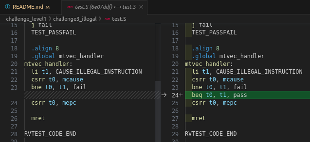

# Bug: Infinite Loop Caused by Illegal Instruction Exception

## Description

In the given code, an exception is intentionally created by executing an illegal instruction (code = 2). The trap is treated in the `mtvec_handler` function. The issue arises from only checking the fail condition (`bne t0, t1, fail`) but never checking the pass condition. The effect of this is that the instruction `mret` will return the program counter (PC) to the last instruction, which is illegal, resulting in an infinite loop.

## Solution

To fix the bug and avoid the infinite loop, it is necessary to add the instruction `beq t0, t1, pass` before or after the `bne t0, t1, fail` instruction. This will ensure that if the pass condition is met, the program proceeds to the `pass` label, thus preventing the infinite loop.

The corrected code can be as follows:

```assembly
  li t1, CAUSE_ILLEGAL_INSTRUCTION
  csrr t0, mcause
  bne t0, t1, fail
  beq t0, t1, pass
  csrr t0, mepc

  mret
```

Or,




With this modification, the code will properly check both the fail and pass conditions preventing the infinite loop and resolving the bug.
