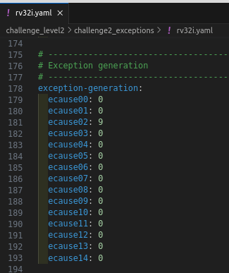
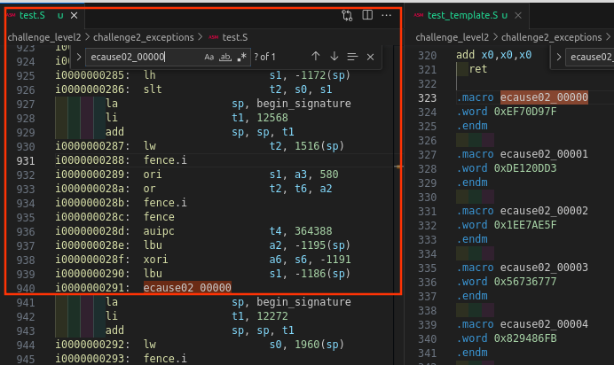
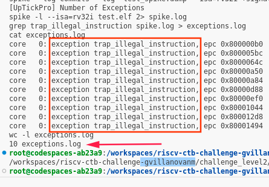

# Challenge: AAPG Generation Test

## Challenge Specification

The challenge is to create an AAPG (Automated Assembly Program Generator) config file that generates a test with 10 illegal exceptions, each with the correct handler code.

## Solution

To complete this challenge, the following steps were followed:

1. The config file used in "challenge_level2/challenge_instructions" was copied to this directory.
2. The line in "rv32i.yaml" was updated from:

   ```
   ecause02: 0
   ```

   to:

   ```
   ecause02: 9
   ```

Or,



Configuring the `ecause02` fields and running AAPG will result in the generation of random assembly routines with exceptions. These routines are incorporated into the `test.S` code, as shown in the figure below.



Each snippet will consist of a `.word` instruction, encompassing anything that does not meet the criteria for a legal instruction in the context of the system. It will cause an exception routing invoking.

This process resembles the challenge exercise found in `challenge_level1/challenge3_illegal`, where was encountered scenarios involving illegal instructions.

3. The AAPG tool was run.

The reason for using "9" instead of "10" was due to the output log test, as shown below. Using "9" resulted in 10 exceptions, in accordance with the challenge specification.



## <!> IMPORTANT NOTE: DO WE HAVE A BUG IN AAPG? <!>

When executing the config file presented in the last section, the output was not always the same. Sometimes, after execution, the simulation never stopped, and other times, the simulation stopped and returned the log presented in the last section.

Attempts were made to create some modifications in "rv32i.yaml," but the same behavior persisted. It is suspected that there may be a bug in AAPG that causes this inconsistent behavior. Further investigation is needed to resolve this issue.

