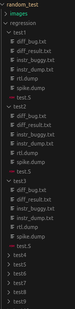
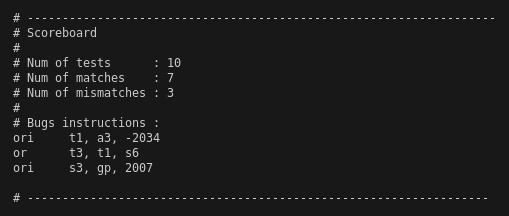
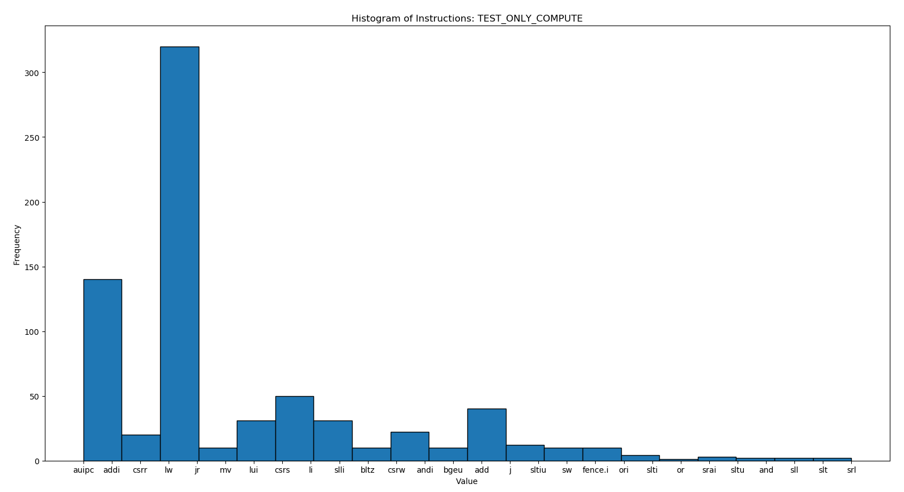
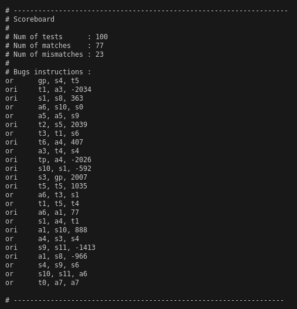
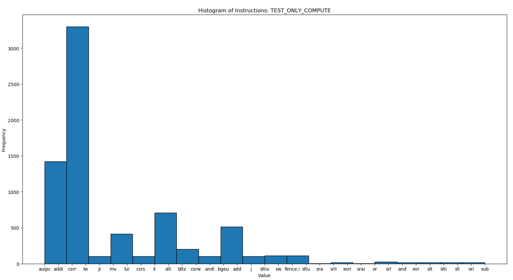
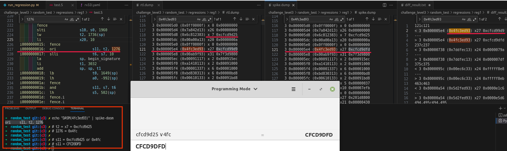
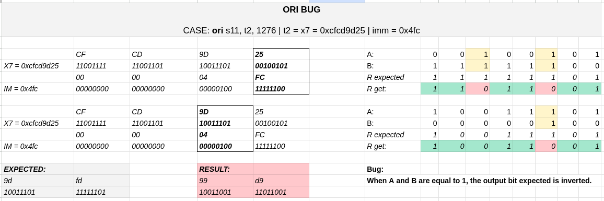
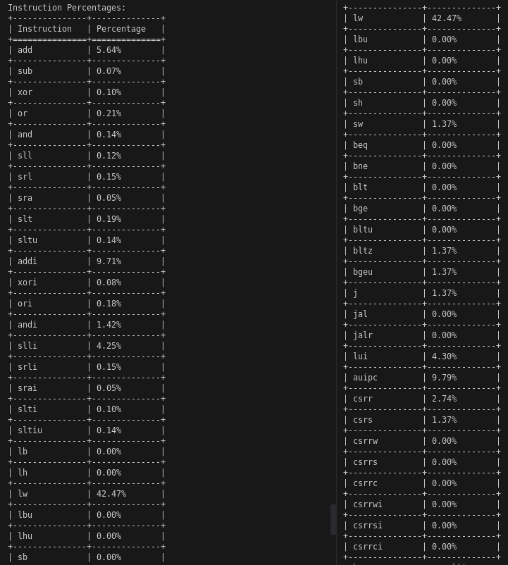

Below is the corrected version of the README.md with improved English grammar:

# Challenge: Random Test - Given Design (riscv_buggy)

## Challenge Specification

Use the AAPG to create an infrastructure that exposes the bug.

## Methodology Overview

The chosen method to verify the Design Under Test (DUT) was Functional Verification (FV). The use of FV is justified due to the infrastructure already in place, such as the AAPG generation, and the comparison method based on the diff command between the DUT and the Reference/Golden Model (refmod or spike). Other strategies, such as UVM or Formal Verification, can be used, but they require more software and RTL access.

The basic steps of a **basic** Functional Verification flow are:

1. Study Design.
2. Define a Verification Plan (VP).
3. Implement the test.
4. Measure, refine, and validate the results.

The process must be repeated if the VP's goals are not reached; otherwise, the verification is considered done. The process is described in detail in the following sections.

### Step 1: Study Design - riscv_buggy

riscv_buggy is a black-box RISC-V with support for RV32I and CSR instructions (this information was shared in slack). These instructions are presented in the Annex Section.

### Step 2: Verification Plan (VP)

In a basic Functional Verification process, a VP is a document that defines the coverage specification, the tests that must be implemented, and the test architecture. Based on the information about the DUT, Reference Model, and the AAPG tool, which aids in the tests creation, the coverage can be based on the expected instructions, and the tests will be based on the AAPG possibilities. The traditional verification architecture can be adapted with the used tools. These topics are discussed as follows.

#### Coverage Specification

All instructions of the DUT (riscv_buggy), which is the RV32I set, and the CSR instructions must be verified. These instructions are presented in the Annex.

#### Test Specification

Controlling the kind of input to stimulate the DUT can help understand the cause of bugs. The AAPG allows different kinds of configuration; however, the focus will be on the below .yaml fields, and the other fields will be set to default with no exceptions being created. Each field below represents a distribution weight; zero means it will never be generated, if it's not zero, it will be generated according to the weight.

```
# ISA
rel_sys.csr: <config>
rel_rv32i.ctrl: <config>
rel_rv32i.compute: <config>
rel_rv32i.data: <config>
rel_rv32i.fence: <config>
```

IMPORTANT NOTE: The total_of_instruction field will be kept equal to one or two in case of bug capture. The reason for doing this is to avoid fake bugs. For instance, imagine that a buggy instruction was executed, and the result was saved in x7. After that, every operation with x7 can potentially be a fake bug. Therefore, keeping the total_of_instructions very small and increasing the number of tests can help find real bugs. Also, for each test, the seed is new, which increases the chance to get a real bug.

The planned tests are presented as follows.

##### TEST_ONLY_DATA

```
# ISA
rel_sys.csr: 0
rel_rv32i.ctrl: 0
rel_rv32i.compute: 0
rel_rv32i.data: 1
rel_rv32i.fence: 0
```

##### TEST_ONLY_COMPUTE

```
# ISA
rel_sys.csr: 0
rel_rv32i.ctrl: 0
rel_rv32i.compute: 1
rel_rv32i.data: 0
rel_rv32i.fence: 0
```

##### TEST_CSR_DATA_FENCE

```
# ISA
rel_sys.csr: 1
rel_rv32i.ctrl: 0
rel_rv32i.compute: 0 
rel_rv32i.data: 1
rel_rv32i.fence: 1
```


##### TEST_ALL

```
# ISA
total_instructions: 30
rel_sys.csr: .1
rel_rv32i.ctrl: .1
rel_rv32i.compute: 1  # has bug
rel_rv32i.data: 1
rel_rv32i.fence: .1
```

For this case, the total_instruction was necessary to fit the distribution specification.

#### Test Architecture

The architecture is based on the traditional verification architecture, which is shown in the Figure below: 1) stimulus generation (sequences) represented as ".bin", 2) driver for the DUT and the Golden Model, 3) compare outputs, and 4) extract the results (scoreboard).


### Step 3: Implement the test

The test infrastructure was implemented in Python (file: run_tests.py) in 3 steps, as shown in the Figure below.
 

 
The routines are based on 3 steps. Step 1 calls the Makefile (# make), which generates the AAPG, cross-compiles the test.S generated by AAPG using the RISCV Toolchain, stimulates (spike and verilator DUT), and returns the diff output between the models of the current test. Step 2 reads the generated diff file, verifies if it is empty or not, and if it's empty, the match variable is incremented, and a PASS message is printed; if not, then the mismatch variable is incremented, and information about the bug is presented (see the Figure below). Finally, Step 3 just prints the scoreboard as presented in the Figure below.


Before executing this script, the test configuration - TEST_ONLY_DATA, TEST_ONLY_COMPUTE, etc - and the number of tests, which can be set by adjusting the variable "num_of_tests" inside the run_tests.py, must be set. After that, the script can be run (# python3 run_tests.py).

Another script was implemented to generate histograms and coverage analysis (run_analysis_reg.py). After executing regressions (see the Figure below), this script reads the generated artifacts, calculates how many instructions were executed, the percentage of execution, plots the histogram, and calculates the percentage of instructions that were exercised compared to all expected instructions (Annex). It is demonstrated in the next Section.



## Results (Measure, refine, and validate)

The results from the application of the Methodology defined will be presented in this Section, as well as the bugs found.

### Test: TEST_ONLY_DATA

#### Regression 1

Configuration:

* num_of_tests = 10
* total_instructions = 2

Result:


Histogram of instructions stimulated:


#### Regression 2

Configuration:

* num_of_tests = 100
* total_instructions = 20

Result:


Histogram of instructions stimulated:


### Discussion and Coverage Status

Two regressions were executed. The first one with 10 tests and 2 instructions; no bugs were encountered. The second one, even with increased parameters num_of_tests to 100 and total_instructions to 20, which create a rich input vector for this configuration, no bugs were encountered either. It means that the bug is not in RV32I.data (see the histogram) but has bugs.

The coverage was calculated for this case. Since it is a subset of all instructions, it didn't reach 100% as expected.


```
Instructions Tested: 24/47
Percentage of Instructions Tested: 51.06%
```

### Test: TEST_ONLY_COMPUTE

#### Regression 1

Configuration:

* num_of_tests = 10
* total_instructions = 2

Result:



Histogram of instructions stimulated:




#### Regression 2

Configuration:

* num_of_tests = 100
* total_instructions = 2

Result:



Histogram of instructions stimulated:



### Discussion and Coverage Status

#### Analysis of Bug and "Fake" Bugs

The test captured a bug in OR and ORI instructions. To understand the cause of the bug, let's consider the scenario presented below.



The highlighted instruction below. Analyzing the literal operation (Figure below), it's possible to understand the real cause of the bug. When A and B are equal to 1, the output bit expected is inverted. The OR instruction also has a bug, and the same analysis can be done to verify the cause in detail.

```
ori s11, t2, 1276 
```



If we increase the number of instructions, the test will return many bugs. However, without an accurate analysis, it's hard to identify if it is a real bug or a bug generated due to the right value assigned to registers after the OR or ORI operation, "fake bug." As a result, it's safer and easier, in terms of bug capture, to keep the number of instructions equal to one or two and increase the number of tests.

#### Coverage

The coverage was calculated in regression 2, and the result is shown below. The increase in relation to the last coverage is due to the set of instructions configured. The compute set (add, xor, xori, etc.) is greater than the compute data set. As a result, the coverage reached 70.21%.

Instructions Tested: 33/47
Percentage of Instructions Tested: 70.21%

The percentage of occurrence is presented below.




# Annex

## RISC-V RV32I Base Integer Instructions Card (need to be reviewed)

| Instruction | Type          | Opcode   | funct3 | funct7 | Format                                 | Description                            |
|-------------|---------------|----------|--------|--------|----------------------------------------|----------------------------------------|
| `ADD`       | R-Type        | 0110011  | 0x0    | 0x00   | rd = rs1 + rs2                        | Add                                  |
| `SUB`       | R-Type        | 0110011  | 0x0    | 0x20   | rd = rs1 - rs2                        | Subtract                             |
| `XOR`       | R-Type        | 0110011  | 0x4    | 0x00   | rd = rs1 ^ rs2                        | XOR (Bitwise Exclusive OR)           |
| `OR`        | R-Type        | 0110011  | 0x6    | 0x00   | rd = rs1 \| rs2                       | OR (Bitwise OR)                      |
| `AND`       | R-Type        | 0110011  | 0x7    | 0x00   | rd = rs1 & rs2                        | AND (Bitwise AND)                    |
| `SLL`       | R-Type        | 0110011  | 0x1    | 0x00   | rd = rs1 << rs2                       | Shift Left Logical                   |
| `SRL`       | R-Type        | 0110011  | 0x5    | 0x00   | rd = rs1 >> rs2                       | Shift Right Logical                  |
| `SRA`       | R-Type        | 0110011  | 0x5    | 0x20   | rd = rs1 >> rs2 (msb-extended)       | Shift Right Arithmetic               |
| `SLT`       | R-Type        | 0110011  | 0x2    | 0x00   | rd = (rs1 < rs2) ? 1 : 0             | Set Less Than                        |
| `SLTU`      | R-Type        | 0110011  | 0x3    | 0x00   | rd = (rs1 < rs2) ? 1 : 0 (zero-ext.) | Set Less Than (Unsigned)             |
| `ADDI`      | I-Type        | 0010011  | 0x0    | -      | rd = rs1 + imm                       | Add Immediate                        |
| `XORI`      | I-Type        | 0010011  | 0x4    | -      | rd = rs1 ^ imm                       | XOR Immediate                        |
| `ORI`       | I-Type        | 0010011  | 0x6    | -      | rd = rs1 \| imm                      | OR Immediate                         |
| `ANDI`      | I-Type        | 0010011  | 0x7    | -      | rd = rs1 & imm                       | AND Immediate                        |
| `SLLI`      | I-Type        | 0010011  | 0x1    | 0x00   | rd = rs1 << imm[0:4]                 | Shift Left Logical Immediate         |
| `SRLI`      | I-Type        | 0010011  | 0x5    | 0x00   | rd = rs1 >> imm[0:4]                 | Shift Right Logical Immediate        |
| `SRAI`      | I-Type        | 0010011  | 0x5    | 0x20   | rd = rs1 >> imm[0:4] (msb-extended) | Shift Right Arithmetic Immediate     |
| `SLTI`      | I-Type        | 0010011  | 0x2    | -      | rd = (rs1 < imm) ? 1 : 0             | Set Less Than Immediate              |
| `SLTIU`     | I-Type        | 0010011  | 0x3    | -      | rd = (rs1 < imm) ? 1 : 0 (zero-ext.) | Set Less Than Immediate (Unsigned)   |
| `LB`        | I-Type        | 0000011  | 0x0    | -      | rd = M[rs1 + imm][0:7]               | Load Byte                            |
| `LH`        | I-Type        | 0000011  | 0x1    | -      | rd = M[rs1 + imm][0:15]              | Load Half                            |
| `LW`        | I-Type        | 0000011  | 0x2    | -      | rd = M[rs1 + imm][0:31]              | Load Word                            |
| `LBU`       | I-Type        | 0000011  | 0x4    | -      | rd = M[rs1 + imm][0:7] (zero-ext.)   | Load Byte (Unsigned)                 |
| `LHU`       | I-Type        | 0000011  | 0x5    | -      | rd = M[rs1 + imm][0:15] (zero-ext.)  | Load Half (Unsigned)                
| `SB`        | S-Type        | 0100011  | 0x0    | -      | M[rs1 + imm][0:7] = rs2[0:7]         | Store Byte                           |
| `SH`        | S-Type        | 0100011  | 0x1    | -      | M[rs1 + imm][0:15] = rs2[0:15]       | Store Half                           |
| `SW`        | S-Type        | 0100011  | 0x2    | -      | M[rs1 + imm][0:31] = rs2[0:31]       | Store Word                           |
| `BEQ`       | B-Type        | 1100011  | 0x0    | -      | if (rs1 == rs2) PC += imm             | Branch if Equal                      |
| `BNE`       | B-Type        | 1100011  | 0x1    | -      | if (rs1 != rs2) PC += imm             | Branch if Not Equal                  |
| `BLT`       | B-Type        | 1100011  | 0x4    | -      | if (rs1 < rs2) PC += imm              | Branch if Less Than                  |
| `BGE`       | B-Type        | 1100011  | 0x5    | -      | if (rs1 >= rs2) PC += imm             | Branch if Greater Than or Equal      |
| `BLTU`      | B-Type        | 1100011  | 0x6    | -      | if (rs1 < rs2) PC += imm (zero-ext.)  | Branch if Less Than (Unsigned)       |
| `BGEU`      | B-Type        | 1100011  | 0x7    | -      | if (rs1 >= rs2) PC += imm (zero-ext.) | Branch if Greater Than or Equal (Unsigned) |
| `JAL`       | J-Type        | 1101111  | -      | -      | rd = PC + 4, PC += imm               | Jump And Link                        |
| `JALR`      | I-Type        | 1100111  | 0x0    | -      | rd = PC + 4, PC = rs1 + imm          | Jump And Link Register               |
| `LUI`       | U-Type        | 0110111  | -      | -      | rd = imm << 12                       | Load Upper Immediate                 |
| `AUIPC`     | U-Type        | 0010111  | -      | -      | rd = PC + (imm << 12)                | Add Upper Immediate to PC            |
| `ECALL`     | I-Type        | 1110011  | 0x0    | -      | imm                                  | Environment Call                     |

## RISC-V CSR Instructions Card

| Instruction | Type          | Opcode   | funct3 | funct7 | Format                                 | Description                            |
|-------------|---------------|----------|--------|--------|----------------------------------------|----------------------------------------|
| `CSRR`     
| `CSRS`   
| `CSRRW`     | I-Type        | 1110011  | 0x1    | -      | rd = M[CSR], M[CSR] = rs1            | Atomic Read/Write CSR                 |
| `CSRRS`     | I-Type        | 1110011  | 0x2    | -      | rd = M[CSR], M[CSR] |= rs1           | Atomic Read and Set CSR               |
| `CSRRC`     | I-Type        | 1110011  | 0x3    | -      | rd = M[CSR], M[CSR] &= ~rs1          | Atomic Read and Clear CSR             |
| `CSRRWI`    | I-Type        | 1110011  | 0x5    | -      | rd = M[CSR], M[CSR] = zimm           | Atomic Read/Write CSR with Immediate  |
| `CSRRSI`    | I-Type        | 1110011  | 0x6    | -      | rd = M[CSR], M[CSR] |= zimm          | Atomic Read and Set CSR with Immediate |
| `CSRRCI`    | I-Type        | 1110011  | 0x7    | -      | rd = M[CSR], M[CSR] &= ~zimm         | Atomic Read and Clear CSR with Immediate |
