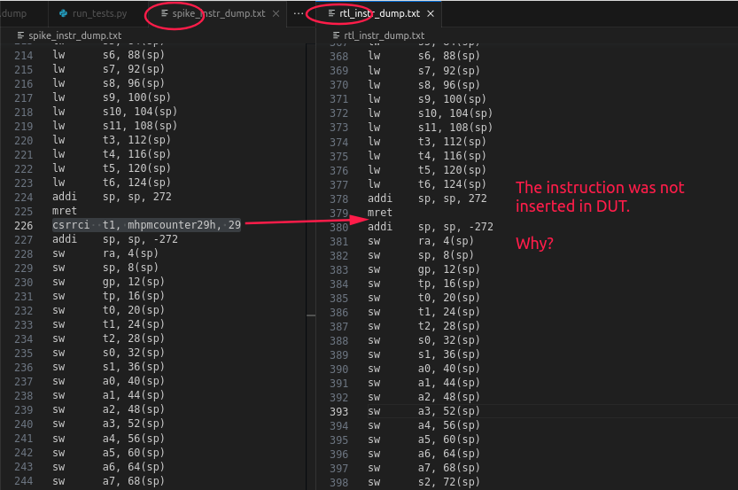

# Challenge 3 Level 1 (C3L1): Capture The Bug - Given Design (`riscv_buggy`)

This repository contains the verification infrastructure and results for the C3L1 challenge - Capture The Bug, which aims to expose bugs in the given design `riscv_buggy`.

## Methodology

For verifying the Design Under Test (DUT), the Functional Verification (FV) methodology was chosen. This decision was based on the existing infrastructure, including the AAPG generation and the comparison method using the "diff" command between the DUT and the Reference/Golden Model (refmod or spike). Other strategies like UVM or Formal Verification could also be used, but they would require more software and RTL (Register Transfer Level) access.

The fundamental steps of the Functional Verification flow are as follows:
1. Study Design
2. Define a Verification Plan (VP)
3. Implement the test
4. Measure, refine, and validate (Results)

The process should be repeated if the VP's goals were not reached, otherwise the verification is considered complete. This process is applied to the given design and described in detail in the next subsections.

## STEP1 - Study Design

The `riscv_buggy` is a black-box RISC-V processor that supports RV32I (RISC-V 32-bit base integer instructions) and CSR (Control and Status Register) instructions.

Considering this level of knowledge about the system, a verification environment is implemented to test every instruction specified (RV32I and CSR instructions). The instruction set details are presented in the Annex section \cite{riscv_isa_vol1}. In a real scenario, much more should be considered.

The next step is to define a Verification Plan.

## STEP2 - Verification Plan (VP)

In general, the Verification Plan (VP) is a document that defines the coverage specification, the tests that need to be implemented, and the test architecture.

Based on the information about the DUT, Reference Model (spike), and the AAPG tool, which assists in test creation, the coverage can be based on the expected instructions, and the tests can be designed to leverage the AAPG possibilities. In addition, the traditional verification architecture can be adapted with the available tools. These topics are presented further in the following subsections.

### Coverage Specification

The verification environment must measure the stimulated instructions and check if all instructions - RV32I and CSR - were covered. It's a stop criterion.

### Test Specification

In this context, the test specification was divided into 1) sequence generation and 2) test infrastructure (stimulus, comparison, and traceability).

#### Sequences Generation

The sequences should be created using the AAPG tool. The AAPG allows configuring the group of instructions, which is better to understand the bugs. It can be done by configuring the fields in the YAML file. These fields are presented below:

```
total_instruction: <config>
rel_sys.csr: <config>
rel_rv32i.ctrl: <config>
rel_rv32i.compute: <config>
rel_rv32i.data: <config>
rel_rv32i.fence: <config>
```

The RV32I instructions can be considered as compute, data, fence, and ctrl. The csr is the Control and Status Register. The field <config> is a value or a weight that the AAPG uses to create the sequences randomly.

An important note is that the "total_of_instructions" field in the first regressions should be kept equal to one or two. This is done to avoid false positives. For example, if a buggy instruction was executed, and its result was saved in register x7, any operation involving x7 could potentially be a false bug. Therefore, by keeping the "total_of_instructions" small and increasing the number of tests, we improve the chances of capturing a real bug. Additionally, each test uses a new seed, which further increases the likelihood of finding a real bug. The planned tests are presented in the next paragraphs.

#### Test Architecture

The test architecture is based on the traditional verification architecture, as shown in the figure below. It includes the following steps:
1. Stimulus generation represented as ".bin"
2. Driving the DUT and the Golden Model
3. Comparing the outputs
4. Extracting the results (scoreboard)


## STEP1 - Test Implementation

The sequences planned, and the details about the verification environment implementation are presented in this section.

### Sequences

The sequences were planned to separate the group of analysis due to the facilitate association in analysis and debugging.

1. **TEST_ONLY_DATA**
   - The configuration file is presented below. It will generate only data instructions (lw, sw, li, sh, lh, etc).

```nasm
rel_sys.csr: 0
rel_rv32i.ctrl: 0
rel_rv32i.compute: 0
rel_rv32i.data: 1
rel_rv32i.fence: 0
```

2. **TEST_ONLY_COMPUTE**
   - The configuration file is presented below. It will generate only compute instructions (or, xor, add, addi, sub, etc).

```nasm
rel_sys.csr: 0
rel_rv32i.ctrl: 0
rel_rv32i.compute: 1
rel_rv32i.data: 0
rel_rv32i.fence: 0
```

3. **TEST_CSR_DATA_FENCE**
   - The configuration file is presented below. It will generate data, fence, and csr instructions. In this case, it's not possible to isolate CSR, then data and fence were set to allow the generation.

```nasm
total_instructions: 3 # needed
rel_sys.csr: 1 # focus
rel_rv32i.ctrl: 0
rel_rv32i.compute: 0 
rel_rv32i.data: .5
rel_rv32i.fence: .5
```

4. **TEST_CTRL_DATA**
   - The configuration file is presented below. It will generate Ctrl (control) and data instructions. Also, it's not possible to isolate Ctrl, then data was included in the generation. In addition, the total instruction needs to be increased to fit the distribution specification.

```nasm
total_instructions: 500
rel_sys.csr: 0 
rel_rv32i.ctrl: 0.2 # focus
rel_rv32i.compute: 0 
rel_rv32i.data: 2
rel_rv32i.fence: 0
```

### Test Implementation

The test infrastructure was implemented in Python (file: `run_tests.py`) in three steps, as shown in the figure below:


The routines are based on these three steps. Step 1 calls the Makefile (`make`) and performs the following actions: AAPG generation, cross-compilation of the generated `test.S` using the RISC-V Toolchain, stimulation (spike and verilator dut), and comparison of the models' outputs using the "diff" command. Step 2 reads the generated "diff" file, verifies if it is empty or not, and increments the "match" variable with

 a PASS message if it is empty, or increments the "mismatch" variable and presents information about the bug. Finally, Step 3 prints the scoreboard.

Before executing this script, the test configuration (`TEST_ONLY_DATA`, `TEST_ONLY_COMPUTE`, etc.) and the number of tests (set by the variable `num_of_tests` inside `run_tests.py`) must be defined. After that, the script can be run (`python3 run_tests.py`). The main infrastructure is based on the last challenges learned.

Another script (`run_analysis_reg.py`) was implemented for generating histograms and conducting coverage analysis. After executing regressions, this script reads the generated artifacts, calculates the number of executed instructions and their percentage, plots the histogram, and calculates the percentage of instructions exercised compared to all expected instructions (Annex). In summary, it implements the coverage analysis by reading the dump files, applying disassembly, and measuring the instructions from that.

The results obtained from applying the defined Methodology will be presented in this section, along with the bugs found.

## Results

The results of the regressions for each configuration are presented below.

### TEST_ONLY_DATA - Regression 1

#### Configuration

- num_of_tests = 10
- total_instructions = 2

#### Result

PASS.


#### Histogram of Instructions Stimulated

Even though only data instructions were configured, the initialization of the system uses other instructions, which are captured in the analysis.

### TEST_ONLY_DATA - Regression 2

#### Configuration

- num_of_tests = 100
- total_instructions = 20

#### Result

PASS.


#### Histogram of Instructions Stimulated

The instructions remained the same, but the frequency increased compared to regression 1.

### TEST_ONLY_COMPUTE - Regression 1

#### Configuration

- num_of_tests = 10
- total_instructions = 2

#### Result

The scoreboard captured bugs in the instructions compute OR and ORI. A deep investigation is presented after regressions.


#### Histogram of Instructions Stimulated

As expected, the compute instructions are presented.


### TEST_ONLY_COMPUTE - Regression 2

#### Configuration

- num_of_tests = 100
- total_instructions = 2

#### Result

Scoreboard.


#### Histogram of Instructions Stimulated

As expected, the compute instructions are presented.


#### Discussion and Coverage Status

The test captured a bug in the OR and ORI instruction. The cause of the bug was analyzed in detail and presented in the documentation.

The coverage was calculated in regression 2, and it reached 70.21%. The increase in coverage is due to the set of instructions configured. The compute set (add, xor, xori, etc.) is greater than the compute data set. As a result, the coverage reached 70.21%.

### TEST_CSR_DATA_FENCE - Regression 1

#### Configuration

- num_of_tests = 30
- total_instructions = 3

#### Result

No bugs were encountered in this case.

### TEST_CSR_DATA_FENCE - Regression 2

#### Configuration

- num_of_tests = 30
- total_instructions = 10

#### Result

The instruction `csrrci` appears in the Spike dump but not in the RTL dump, resulting in an inconsistency. Therefore, the test environment returns a bug. However, this bug seems to be related to the tool rather than the design. As a result, it will not be considered a bug in `riscv_buggy`.



### TEST_CTRL_DATA

The method was executed under this configuration and demonstrated exceptional stability with no encountered bugs, even during exhaustive stimulation.

## Conclusion for `riscv_buggy`

Based on the tested extensions and strategy, the result of `riscv_buggy` verification is summarized below. The tests encountered bugs in the OR and ORI instructions and an inconsistency in CSR.

```
Extension          RESULT/STATUS
rel_sys.csr        INCONSISTENT
rel_rv32i.ctrl     NO BUGS
rel_rv32i.compute  BUGS: OR/ORI instr.
rel_rv32i.data     NO BUGS
rel_rv32i.fence    NO BUGS
```

Considering all the regression results, the specified coverage reaches 100%. However, it is important to note that due to the encountered bugs, merging the results might not provide a meaningful representation of the overall coverage in this case. The identified bugs should be carefully addressed and resolved before concluding the final coverage assessment.

In a real development flow, these results should be discussed with the designer responsible to address the problems. After that, the same tests should pass, and finally, a refinement in the VP also should be made to stimulate the design in different ways and achieve coverage.
