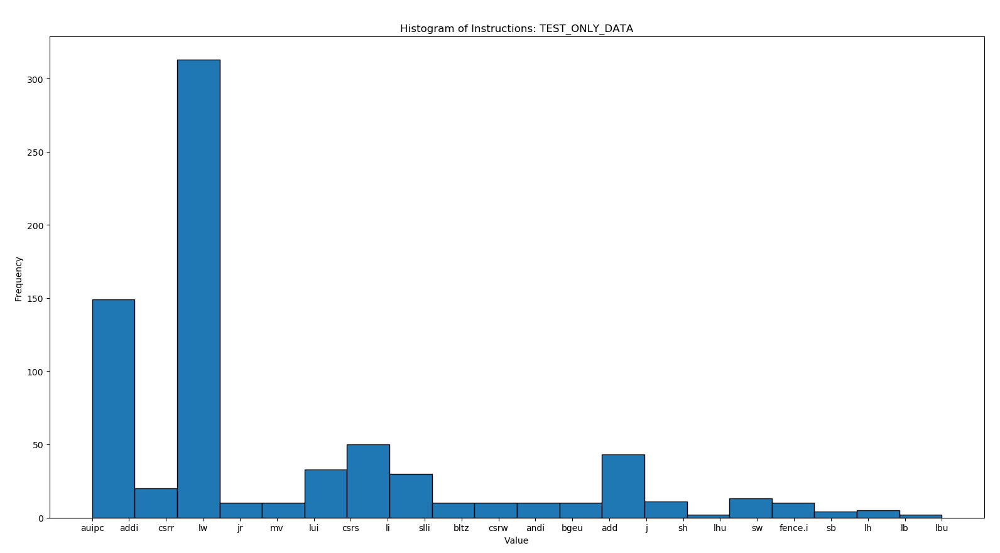

# Challenge: Random Test - Given Design (riscv_buggy)

## Challenge Specification

Use the AAPG and create an infrastrucure that exposes the bug.

## Methodology

The method chosen to verify the Design Under Test (DUT) was the Fuctional Verification (FV). The use of FV is justified due to the insfracture already done, for instance, the AAPG generation, and the comparision method based on diff command between the DUT and the Reference/Golden Model (refmod, or spike). Another strategies, such as UVM or Formal Verification, can be used, but it depends on more software and RTL access. 

The basic steps of a **basic** Functional Verification flow is:

1. Study Design;
2. Define a Verification Plan (VP); 
3. Implement the test;
4. Measure, refine and validate (Results);

The process must be repeated if the VP's goals was not reached, otherwise the verification is done.

### Step 1: Study Design: riscv_buggy

The riscv_buggy is a black-box RISC-V with support to RV32I and CSR instructions (this information was shared in slack). These instructions are presented in the Annex Section.

### Step 2: Verification Plan (VP)

In a basic Functional Verification process, a VP is a document to define the coverage specification, the tests that must be implemented, and the test archictecture. Based on the information about the DUT, Reference Model and the AAPG tool, which auxiliate in the tests creation, the coverage can be based in the instructions expected, the tests will be based on the AAPG possibilities, and the traditional verification archicteture can be adapted with the used tools. These topic are discussed as following.

#### Coverage Specification

All instructions of the DUT (riscv_buggy), which is the RV32I set, and the CSR instructions, must be verified. These instructions are presented in the Annex.

#### Test Specification

Controlling the kind of input to stimulate the DUT can help to understand the bug's cause. The AAPG allows different kind of configuration, however, the focus will be in the below .yaml fields, and the other fields will be default with no exceptions being created. Each field below represents a distribuition weight, zero means never be generated, if it's not zero it will be generated according to the weigth. 

```
# ISA
rel_sys.csr: <config>
rel_rv32i.ctrl: <config>
rel_rv32i.compute: <config>
rel_rv32i.data: <config>
rel_rv32i.fence: <config>
```

IMPORTANT NOTE: The total_of_instruction field will be kept equal to one or two in case of bug capture. The reason to do it is to avoid fake bugs. For instance, imagine that an buggy instruction was executed and the register was saved in x7. After that, every operation with x7 can be potencially a fake bug. Therefore, keeping the total_of_instructions very small and incrasing the number of tests a real bug can be find. Also, for each test the seed is new, and it increases the change to get a real bug.

The tests planned are presented as follow.

##### TEST_ONLY_DATA	

```
# ISA
rel_sys.csr:	0
rel_rv32i.ctrl:	0
rel_rv32i.compute:	0
rel_rv32i.data:	1
rel_rv32i.fence:	0
```

##### TEST_ONLY_COMPUTE

rel_sys.csr:	0
rel_rv32i.ctrl:	0
rel_rv32i.compute:	1
rel_rv32i.data:	0
rel_rv32i.fence:	0

##### TEST_ONLY_???

#### Test Architecture

The architecture is based on traditional verification architecture, which is shown in Figure below, is 1) stimulus generation (sequences) that is represented as ".bin", 2) driver the DUT and the Golden Model, 3) compare outputs, and 4) extract the results (scoreboard).


### Step 3: Implement the test

The test infrastructure was implemented in Python (file: run_tests.py) in 3 steps as show in Figure below.
 

 
The routines are based on 3 steps. The Step 1 calls the Makefile (# make), and it makes the generation (AAPG), the cross-compilation of the test.S generated by AAPG using the RISCV Toolchain, the stimulutation (spike and verilator dut), and returns the diff output between the models of the current test; the Step 2 reads the diff file generated, verifies if it is empty or not, if it's empty than the match variable is incremented and a PASS message is printed, if not then the mismatch variable is incremented and information about the bug is presented (see Figure below). Finally, the Step 3 just print the scoreboard as presented in Figure below.


Before execute this script, the configuration of the test - TEST_ONLY_DATA, TEST_ONLY_COMPUTE, etc -, and the number of tests, which can be made setting the variable "num_of_tests" inside the run_tests.py, must be set. After that, the script can be run (# python3 run_tests.py).

Another script was implemented to generate histogram and coverage analysis. After execution of regressions (see Figure below), this script read the artefacts to generate the results. It is demonstrated in next Section.

## Results (Measure, refine and validate)

The results from the application of the Methodology defined will be presented in this Section, as well as the bugs found. 

### Test: TEST_ONLY_DATA

#### Regression 1

Configuration:

* num_of_tests = 10
* total_instructions = 2

Result:


Histogram of instructions stimulated:




##### Discussion

No bugs encountered.

#### Regression 2

Configuration:

* num_of_tests = 100
* total_instructions = 20

Result:


Histogram of instructions stimulated:


##### Discussion

No bugs encountered.

### Coverage Status


```
Instructions Tested: 24/47
Percentage of Instructions Tested: 51.06%
```

### Conclusion

Even increasing the parameters num_of_tests to 100 and total_instructions to 20, which create a rich input vector for this configuration, no bugs were encountered.


# Annex

## RISC-V RV32I Base Integer Instructions Card (need to be reviewed)

| Instruction | Type          | Opcode   | funct3 | funct7 | Format                                 | Description                            |
|-------------|---------------|----------|--------|--------|----------------------------------------|----------------------------------------|
| `ADD`       | R-Type        | 0110011  | 0x0    | 0x00   | rd = rs1 + rs2                        | Add                                  |
| `SUB`       | R-Type        | 0110011  | 0x0    | 0x20   | rd = rs1 - rs2                        | Subtract                             |
| `XOR`       | R-Type        | 0110011  | 0x4    | 0x00   | rd = rs1 ^ rs2                        | XOR (Bitwise Exclusive OR)           |
| `OR`        | R-Type        | 0110011  | 0x6    | 0x00   | rd = rs1 \| rs2                       | OR (Bitwise OR)                      |
| `AND`       | R-Type        | 0110011  | 0x7    | 0x00   | rd = rs1 & rs2                        | AND (Bitwise AND)                    |
| `SLL`       | R-Type        | 0110011  | 0x1    | 0x00   | rd = rs1 << rs2                       | Shift Left Logical                   |
| `SRL`       | R-Type        | 0110011  | 0x5    | 0x00   | rd = rs1 >> rs2                       | Shift Right Logical                  |
| `SRA`       | R-Type        | 0110011  | 0x5    | 0x20   | rd = rs1 >> rs2 (msb-extended)       | Shift Right Arithmetic               |
| `SLT`       | R-Type        | 0110011  | 0x2    | 0x00   | rd = (rs1 < rs2) ? 1 : 0             | Set Less Than                        |
| `SLTU`      | R-Type        | 0110011  | 0x3    | 0x00   | rd = (rs1 < rs2) ? 1 : 0 (zero-ext.) | Set Less Than (Unsigned)             |
| `ADDI`      | I-Type        | 0010011  | 0x0    | -      | rd = rs1 + imm                       | Add Immediate                        |
| `XORI`      | I-Type        | 0010011  | 0x4    | -      | rd = rs1 ^ imm                       | XOR Immediate                        |
| `ORI`       | I-Type        | 0010011  | 0x6    | -      | rd = rs1 \| imm                      | OR Immediate                         |
| `ANDI`      | I-Type        | 0010011  | 0x7    | -      | rd = rs1 & imm                       | AND Immediate                        |
| `SLLI`      | I-Type        | 0010011  | 0x1    | 0x00   | rd = rs1 << imm[0:4]                 | Shift Left Logical Immediate         |
| `SRLI`      | I-Type        | 0010011  | 0x5    | 0x00   | rd = rs1 >> imm[0:4]                 | Shift Right Logical Immediate        |
| `SRAI`      | I-Type        | 0010011  | 0x5    | 0x20   | rd = rs1 >> imm[0:4] (msb-extended) | Shift Right Arithmetic Immediate     |
| `SLTI`      | I-Type        | 0010011  | 0x2    | -      | rd = (rs1 < imm) ? 1 : 0             | Set Less Than Immediate              |
| `SLTIU`     | I-Type        | 0010011  | 0x3    | -      | rd = (rs1 < imm) ? 1 : 0 (zero-ext.) | Set Less Than Immediate (Unsigned)   |
| `LB`        | I-Type        | 0000011  | 0x0    | -      | rd = M[rs1 + imm][0:7]               | Load Byte                            |
| `LH`        | I-Type        | 0000011  | 0x1    | -      | rd = M[rs1 + imm][0:15]              | Load Half                            |
| `LW`        | I-Type        | 0000011  | 0x2    | -      | rd = M[rs1 + imm][0:31]              | Load Word                            |
| `LBU`       | I-Type        | 0000011  | 0x4    | -      | rd = M[rs1 + imm][0:7] (zero-ext.)   | Load Byte (Unsigned)                 |
| `LHU`       | I-Type        | 0000011  | 0x5    | -      | rd = M[rs1 + imm][0:15] (zero-ext.)  | Load Half (Unsigned)                
| `SB`        | S-Type        | 0100011  | 0x0    | -      | M[rs1 + imm][0:7] = rs2[0:7]         | Store Byte                           |
| `SH`        | S-Type        | 0100011  | 0x1    | -      | M[rs1 + imm][0:15] = rs2[0:15]       | Store Half                           |
| `SW`        | S-Type        | 0100011  | 0x2    | -      | M[rs1 + imm][0:31] = rs2[0:31]       | Store Word                           |
| `BEQ`       | B-Type        | 1100011  | 0x0    | -      | if (rs1 == rs2) PC += imm             | Branch if Equal                      |
| `BNE`       | B-Type        | 1100011  | 0x1    | -      | if (rs1 != rs2) PC += imm             | Branch if Not Equal                  |
| `BLT`       | B-Type        | 1100011  | 0x4    | -      | if (rs1 < rs2) PC += imm              | Branch if Less Than                  |
| `BGE`       | B-Type        | 1100011  | 0x5    | -      | if (rs1 >= rs2) PC += imm             | Branch if Greater Than or Equal      |
| `BLTU`      | B-Type        | 1100011  | 0x6    | -      | if (rs1 < rs2) PC += imm (zero-ext.)  | Branch if Less Than (Unsigned)       |
| `BGEU`      | B-Type        | 1100011  | 0x7    | -      | if (rs1 >= rs2) PC += imm (zero-ext.) | Branch if Greater Than or Equal (Unsigned) |
| `JAL`       | J-Type        | 1101111  | -      | -      | rd = PC + 4, PC += imm               | Jump And Link                        |
| `JALR`      | I-Type        | 1100111  | 0x0    | -      | rd = PC + 4, PC = rs1 + imm          | Jump And Link Register               |
| `LUI`       | U-Type        | 0110111  | -      | -      | rd = imm << 12                       | Load Upper Immediate                 |
| `AUIPC`     | U-Type        | 0010111  | -      | -      | rd = PC + (imm << 12)                | Add Upper Immediate to PC            |
| `ECALL`     | I-Type        | 1110011  | 0x0    | -      | imm                                  | Environment Call                     |

## RISC-V CSR Instructions Card

| Instruction | Type          | Opcode   | funct3 | funct7 | Format                                 | Description                            |
|-------------|---------------|----------|--------|--------|----------------------------------------|----------------------------------------|
| `CSRR`     
| `CSRS`   
| `CSRRW`     | I-Type        | 1110011  | 0x1    | -      | rd = M[CSR], M[CSR] = rs1            | Atomic Read/Write CSR                 |
| `CSRRS`     | I-Type        | 1110011  | 0x2    | -      | rd = M[CSR], M[CSR] |= rs1           | Atomic Read and Set CSR               |
| `CSRRC`     | I-Type        | 1110011  | 0x3    | -      | rd = M[CSR], M[CSR] &= ~rs1          | Atomic Read and Clear CSR             |
| `CSRRWI`    | I-Type        | 1110011  | 0x5    | -      | rd = M[CSR], M[CSR] = zimm           | Atomic Read/Write CSR with Immediate  |
| `CSRRSI`    | I-Type        | 1110011  | 0x6    | -      | rd = M[CSR], M[CSR] |= zimm          | Atomic Read and Set CSR with Immediate |
| `CSRRCI`    | I-Type        | 1110011  | 0x7    | -      | rd = M[CSR], M[CSR] &= ~zimm         | Atomic Read and Clear CSR with Immediate |
