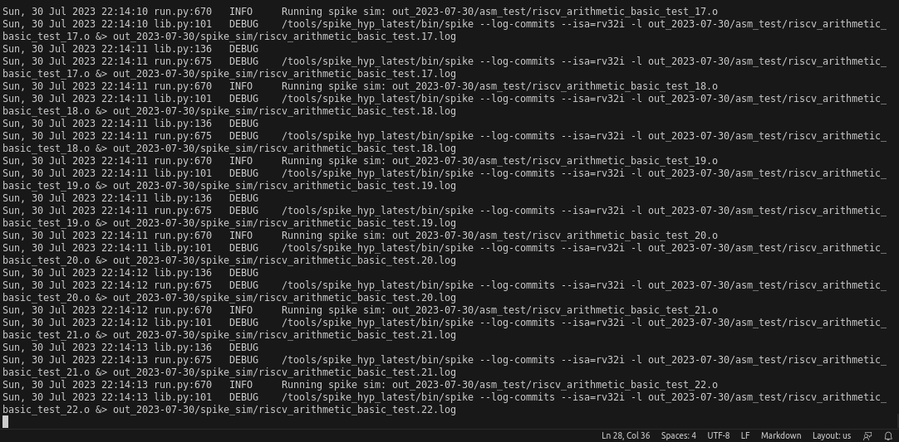
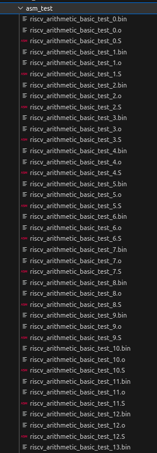
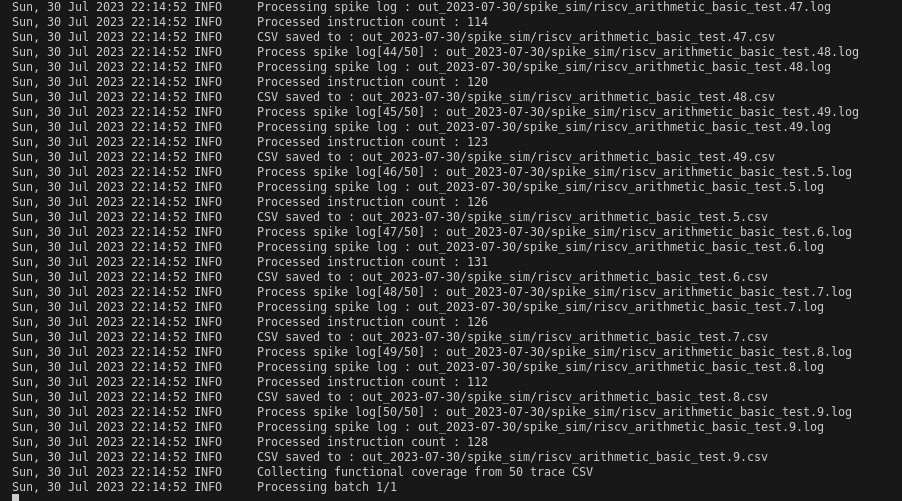

# RISCV-DV Test Coverage Enhancement

## Introduction
The objective of this activity was to improve test coverage in the RISCV-DV tool for the rv32i ISA. Despite various configurations being tested and evaluated, achieving 100% coverage was challenging due to time constraints, lack of documentation, and limited knowledge of the tool.

## Test Generation and Interaction
RISCV-DV was used for test generation with the following command:

```bash
run --target rv32i --test riscv_arithmetic_basic_test --testlist testlist.yaml --simulator pyflow
```

To control the number of tests, the `-i` (interaction) parameter was utilized. For instance:

```bash
run --target rv32i --test riscv_arithmetic_basic_test --testlist testlist.yaml --simulator pyflow -v -i 50
```

This command generated 50 tests as observed in Figure below.



## Test Analysis and Coverage
The generated tests can be analyzed as shown in Figure below:



Coverage information can be obtained using the `cov` tool with the following command:

```bash
cov --dir out_*/spike_sim --enable_visualization  --simulator pyflow
```

The resulting output is depicted in Figure below:



To analyze the coverage metrics, it is necessary to read the `CoverageReport.txt` in the `cov_*/` folder, as demonstrated in Figure below:


## Conclusion and Next Steps
While various configurations were tested and evaluated, achieving 100% coverage was not realized due to the limited availability of documentation, time constraints, and unfamiliarity with the tool.

For future improvements, it is essential to explore the tool's documentation and seek assistance from the community to address the coverage issues efficiently. Additionally, further analysis of uncovered areas in the ISA and targeted test generation could be performed to enhance coverage results.